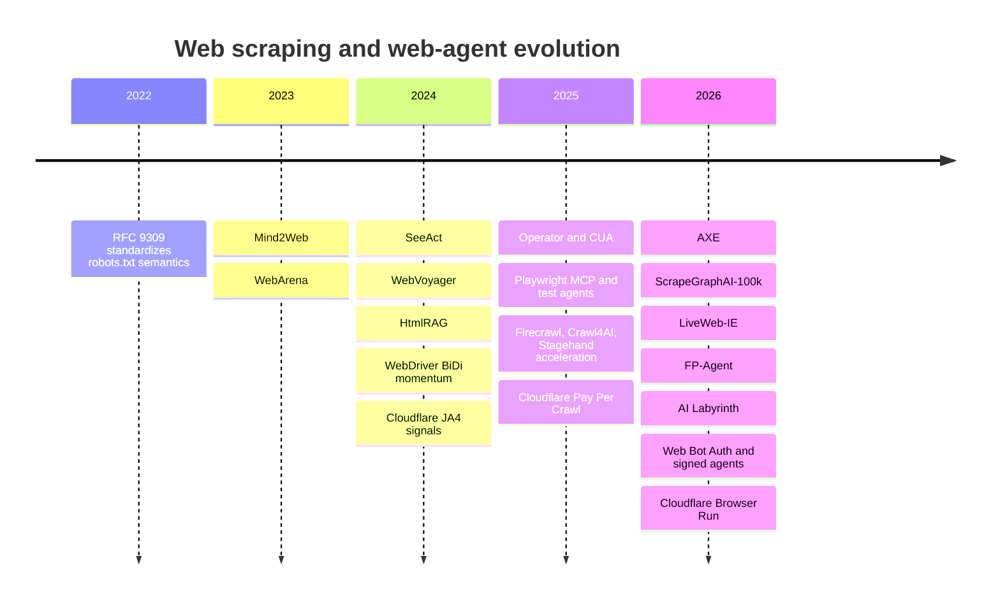
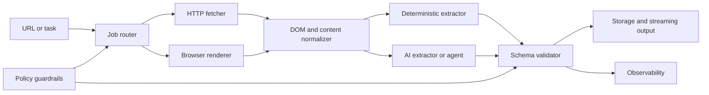

# Web Scraping in 2026

## Executive summary

The biggest change in web scraping from 2022 to 2026 is not that AI replaced scrapers. It is that scraping stacks became **hybrid**. The winning systems now combine deterministic parsers, browser automation, managed browser infrastructure, and optional AI layers for discovery, schema induction, fallback extraction, validation, and repair. Official product positioning from Playwright, Browserbase, Firecrawl, Apify, Bright Data, and Cloudflare all now explicitly frame their tooling around AI agents, MCP, AI extraction, or browser automation for agent workflows rather than only classic HTML parsing. citeturn1search0turn31search0turn4search3turn31search3turn31search2turn39search0

AI does **not** make traditional scrapers obsolete. It shifts where value sits. Deterministic extraction remains cheaper, faster, and more auditable for stable pages and known schemas. Firecrawl’s own docs say single-page `/scrape` is the cheapest and most predictable option when you know the URL, while its `/agent` mode costs more but automates discovery. Crawl4AI similarly warns that LLM extraction is slower and costlier than schema-based CSS/XPath extraction. Academic results point the same way: end-to-end LLM agents make complex sites more accessible to non-experts, but static and simpler sites often still favor scripting and selectors. citeturn12view0turn11search0turn23view0turn28search5

The main role of AI in 2026 scraping is as a **control plane** and **fallback plane**: generating code, mapping page structure, repairing selectors, routing jobs to the right execution mode, extracting long-tail fields from messy pages, and feeding downstream RAG or research agents. The strongest trend is not “ask one model to do all scraping,” but rather “use models selectively where rules break or discovery is required.” Research in HtmlRAG, AXE, LiveWeb-IE, and ScrapeGraphAI-100k all pushes toward keeping more HTML structure, pruning DOMs intelligently, and training smaller extraction models from real telemetry or synthetic supervision instead of sending raw pages to a giant model every time. citeturn25search0turn23view1turn23view2turn23view3turn25search5

The anti-bot landscape also changed materially. Detection is moving both **lower in the stack** and **higher in context**. Lower means TLS / JA3 / JA4, device and browser fingerprints, and cross-request network intelligence. Higher means behavioral biometrics, sequence rules, challenge orchestration, identity verification, and even AI-crawler-specific controls such as Cloudflare’s Block AI Bots, AI Labyrinth, verified bots, signed agents, and Web Bot Auth. Recent academic work reinforces this direction: evasive bots often succeed by spoofing fingerprints, but they also introduce inconsistencies that defenders can detect; AI browsing agents themselves now exhibit classifiable browser and behavioral signatures. citeturn3search0turn3search1turn3search2turn2search0turn19search0turn37search0turn37search11turn24search1turn23view4turn36view0

For reviving a scraping library, the opportunity is strong if you position it as a **deterministic-first, AI-augmented, compliance-aware extraction runtime**, not as yet another “AI scraper.” The market is crowded with thin wrappers around browsers and LLMs, but there is still room for a developer-first library that gives users a precise core, strong observability, optional AI layers, and clean safety/compliance controls. That is where the durable moat is. citeturn32search0turn32search2turn33search0turn31search19

## Market and research trends

From 2022 to 2026, the field moved through five distinct phases: standardization of crawler norms, rise of general web-agent benchmarks, multimodal browser agents, MCP-mediated tool ecosystems, and finally a hard pivot toward bot identity, AI-crawler monetization, and live-web extraction benchmarks. citeturn3search3turn7search1turn7search2turn9search0turn9search1turn31search0turn31search3turn19search4turn23view2turn2search0

The timeline matters because it shows the transition from “scraping websites” to “operating on the live web with model-mediated tooling.” RFC 9309 made robots.txt an official standard but expressly noted that it is not an authorization mechanism. Mind2Web and WebArena then gave the research community realistic datasets and environments for general web agents. In 2024, SeeAct and WebVoyager established multimodal web agents as a viable direction, while HtmlRAG argued that HTML itself, not flattened text, is often the better input format for downstream reasoning. In 2025 and 2026, commercial systems caught up: Playwright added MCP positioning, OpenAI released CUA-based browser operation, and Cloudflare shipped AI-specific bot controls, Pay Per Crawl, AI Labyrinth, Web Bot Auth, and Browser Run. citeturn3search3turn7search1turn7search2turn9search0turn9search1turn25search0turn10search1turn31search0turn19search4turn2search0turn37search0turn39search0

Market-wise, the strongest vendor narrative is that teams are buying **outcomes**, not just libraries. Zyte’s 2026 report frames the six major trends as data outcomes replacing traditional stacks, AI becoming the core engine, autonomous self-healing pipelines, a growing anti-bot arms race, web access splitting into differentiated rules, and rising governance demands. Zyte’s 2025 developer report makes the same point more bluntly: scraping may be easier, but scaling is still hard. A vendor-neutral, primary-source 2026 TAM figure for the software category itself was not found in this research set, so exact market size should be treated as unspecified. citeturn32search0turn32search2

The most commercially durable use cases have not changed much, but their packaging has. Price intelligence, market research, brand monitoring, lead enrichment, business-data products, AI/RAG ingestion, deep-research agents, and training-data acquisition all remain prominent. What changed is that vendors now increasingly bundle these as managed APIs, datasets, or agent tooling rather than asking buyers to assemble proxies, headless browsers, and parsers by hand. citeturn20search10turn20search6turn20search17turn20search1turn20search3turn20search7turn20search15turn20search21

A second major trend is that research is becoming more realistic. Static benchmark snapshots are losing credibility for evaluating production extraction. LiveWeb-IE is explicit that offline HTML snapshots do not capture the evolving web, and it introduces online evaluation on trusted, permission-granted live sites. That is important for a library author: the future benchmark is not “can it parse a static DOM,” but “can it remain reliable as DOMs, assets, and interaction flows drift.” citeturn23view2

## AI integration and architecture patterns

The most important architectural insight in 2026 is that AI is best used **selectively**, not universally. A modern scraper should decide among at least four execution paths: raw HTTP fetch, rendered browser fetch, deterministic extraction, and AI extraction or agentic discovery. Firecrawl’s product split between `/scrape`, `/extract`, and `/agent` formalizes that routing logic. Crawl4AI says the same thing from the open-source side: use CSS/XPath when the page is structured, escalate to LLMs only when semantic interpretation is required. citeturn12view0turn11search0

This hybrid pattern aligns with both research and production tooling. HtmlRAG preserves HTML structure for better reasoning. AXE prunes irrelevant DOM content so smaller models can perform better at much lower cost. LiveWeb-IE’s Visual Grounding Scraper uses a multi-stage agentic flow that visually narrows content before extraction. Browserbase and Cloudflare operationalize the browser side of the stack with serverless or managed browser sessions, while Selenium WebDriver BiDi and Apify webhooks emphasize event-driven orchestration. citeturn25search0turn23view1turn23view2turn13search0turn39search0turn13search3turn13search5

The practical AI techniques now visible in scraping pipelines are summarized below.

| Technique | What it is doing in 2026 | Maturity | Representative evidence |
|---|---|---|---|
| LLM schema extraction | Turn HTML or cleaned Markdown into JSON under a supplied schema or prompt | Mainstream in managed APIs and OSS frameworks | Firecrawl structured extraction and endpoint split; Crawl4AI LLM extraction docs citeturn1search2turn12view0turn11search0 |
| Natural-language browser automation | Replace brittle selectors with semantic actions like “click the submit button” or “extract the top 8 companies” | Mainstream for agents, not enough alone for large-scale batch extraction | Stagehand primitives; Browserbase data-retrieval docs citeturn4search13turn20search1turn5search2 |
| Multimodal / vision-based extraction | Use screenshots plus DOM or accessibility context to operate on dynamic sites and messy UIs | Fast-growing frontier | OpenAI CUA uses screenshots plus RL; SeeAct and WebVoyager show strong multimodal web-agent performance; LiveWeb-IE introduces visual grounding citeturn10search1turn9search0turn9search1turn23view2 |
| Accessibility-tree control | Use structured accessibility snapshots instead of raw pixels whenever possible | High-value, highly practical | Playwright MCP and Cloudflare Playwright MCP both emphasize accessibility snapshots over screenshots citeturn38search5turn39search5 |
| Retrieval-augmented extraction | Keep HTML structure or cleaned DOM chunks as retrievable context for downstream reasoning or Q&A | Fast-growing | HtmlRAG, Firecrawl docs, Bright Data deep-research docs citeturn25search0turn25search11turn31search1turn20search7 |
| Reinforcement learning | Improve long-horizon browser interaction and GUI task completion | Product frontier and active research | OpenAI CUA uses RL; WebAgent-R1 applies end-to-end multi-turn RL for web agents citeturn10search1turn9search11 |
| Synthetic supervision | Generate or refine web tasks and traces to adapt agents to new sites | Research trend with clear product relevance | SynthAgent and related web-trajectory synthesis work citeturn25search5turn25search17turn25search13 |
| Telemetry-native model adaptation | Train smaller extractors from real extraction traces rather than hand labels alone | Emerging and promising | ScrapeGraphAI-100k shows real-world telemetry and fine-tuning of a 1.7B model toward larger-model performance citeturn23view3 |
| Few-shot prompting | Use task examples or schema examples to stabilize extraction | Still useful, but easy to overdo | Few-shot selection and over-prompting studies show gains are context-dependent, not universally monotonic citeturn25search18turn25search10 |
| Self-supervised learning | Important in adjacent representation-learning research, but broad commercial disclosure for scraping products is mostly unspecified | Emerging, evidence stronger in research than product docs | SSL survey plus HTML-pretraining and telemetry/extraction research; vendor-level adoption often unspecified citeturn8search5turn25search8turn23view3 |

The core architecture patterns remain stable, but their operational packaging improved. Scrapy is still relevant because it is asynchronous and event-driven, with broad-crawl tuning guidance around concurrency and DNS thread pools. Playwright, Puppeteer, and Selenium remain foundational for dynamic pages, but now sit behind cloud runtimes, MCP servers, and AI helpers. Browserbase Functions, Cloudflare Browser Run, Apify Actors, and Browserless all point to the same trend: serverless or remotely managed browsers are becoming a default deployment model for teams that need coverage without maintaining fleets themselves. citeturn16search0turn30search0turn1search0turn16search1turn16search3turn13search0turn39search0turn31search3turn4search4

A related trend is event-driven and streaming orchestration. Selenium’s WebDriver BiDi exposes real-time browser events over WebSockets. Apify Actors support webhooks for run completion. Cloudflare demonstrates queued crawling with Browser Run and Workers. Browserbase exposes replay streams as HLS and live views for human-in-the-loop recovery. This matters because large production scrapers increasingly look like workflow systems, not scripts. citeturn13search3turn6search11turn13search5turn39search4turn30search2turn30search7

## Tools and platforms that matter now

The table below groups the most relevant 2026 tools and platforms for a library author. It is not exhaustive, but it captures the current design space.

| Segment | Representative tools | What matters now | Best fit | Sources |
|---|---|---|---|---|
| Deterministic crawler framework | Scrapy | Async, event-driven architecture; strong broad-crawl tuning; still a serious production core | Large-scale, known-host crawling with custom pipelines | citeturn16search0turn16search4turn30search0 |
| Cross-browser automation | Playwright | Cross-browser automation, test isolation, MCP, AI-agent framing, accessibility snapshots | Dynamic sites, authenticated flows, robust browser control | citeturn1search0turn38search5turn38search0 |
| DevTools / browser API layer | Puppeteer | Chrome/Firefox automation via DevTools Protocol or WebDriver BiDi | Chromium-heavy or Node-centric automation | citeturn16search1turn39search1 |
| Standards-first automation | Selenium | W3C WebDriver, BiDi streaming events, native browser driving | Long-lived cross-language browser automation | citeturn16search3turn13search3turn13search16 |
| Cloud crawler platform | Apify + Crawlee | Actors, storage, schedules, webhooks, proxy platform, MCP, AI integrations | Hosted jobs, marketplace distribution, cloud execution | citeturn1search1turn31search3turn31search15turn13search5 |
| AI-native extraction API | Firecrawl | Search, scrape, crawl, agent endpoints; structured extraction; MCP; LLM-oriented outputs | AI workflows, research agents, RAG pipelines | citeturn1search2turn12view0turn31search1turn5search1 |
| OSS AI-first crawler | Crawl4AI | Markdown generation, CSS/XPath extraction, LLM extraction, schema generation | Open-source hybrid extraction stacks | citeturn1search3turn11search0turn5search0 |
| AI browser framework | Stagehand | Natural-language act / extract / observe / agent primitives | Semantic browser automation and agent workflows | citeturn4search13turn5search2 |
| Managed browser infrastructure | Browserbase | Managed browsers, serverless Functions, observability, session replay, AI integrations | Teams that want browser runtime without fleet ops | citeturn4search3turn13search0turn30search5 |
| Remote browser and REST automation | Browserless | BaaS plus one-shot REST APIs for scraping, screenshots, export | Existing Playwright/Puppeteer codebases that need remote execution | citeturn4search4turn4search10 |
| Managed unblocker + extraction | Zyte API | Unblocking, headless rendering, AI extraction, Scrapy ecosystem fit | High-scale enterprise scraping with build-vs-buy flexibility | citeturn4search5turn4search8turn33search0 |
| Web-data platform | Bright Data | Prebuilt scrapers, datasets, AI scrapers, MCP, enrichment and training-data patterns | Buyers who want data products, APIs, or datasets | citeturn17search6turn17search15turn31search2turn20search15turn20search21 |
| Automatic page-type extraction | Diffbot | Computer vision + NLP to classify and extract structured facts from pages | High-level extraction where hand-written rules are undesirable | citeturn17search2turn17search5 |
| Serverless browser in edge stack | Cloudflare Browser Run | Headless Chrome on Cloudflare’s network, session reuse, queue integration, MCP fork | Edge-deployed automation and crawl jobs | citeturn39search0turn39search4turn39search9turn39search5 |

A notable 2025-2026 meta-trend is that scraping vendors are also becoming **AI tooling vendors**. Playwright MCP, Apify MCP, Firecrawl MCP, Bright Data MCP, Browserbase MCP, and Cloudflare’s Playwright MCP all expose scraping or browser automation as tools consumable by agents and coding assistants. For a library author, that means the interface surface is shifting from “SDK only” to “SDK + CLI + MCP + agent skills.” citeturn31search0turn31search3turn31search1turn31search2turn4search14turn39search5

## Detection, anti-bot controls, and the arms race

Defenders now assume bots can run real browsers, patch visible automation markers, maintain low request rates, and even solve some challenges. Cloudflare describes bot management as a layered system of heuristics, machine learning, anomaly detection, and JavaScript fingerprinting, with bot scores and optional sequence rules. HUMAN emphasizes behavior-based detection across hundreds of signals, and DataDome markets a traffic-control plane built around humans, bots, and AI agents. This is a very different world from legacy “headless equals bot” heuristics. citeturn3search0turn3search4turn3search12turn2search2turn2search1

The detection stack is also moving into stronger identity and network signals. Cloudflare makes JA3/JA4 available for bot management, notes that JA4 reduces fingerprint fragmentation by sorting ClientHello extensions, and exposes Signals Intelligence on top of JA4. Academic work from 2026 shows that TLS ClientHello characteristics and JA4 fingerprints can distinguish bad bots from human traffic, though with practical limits. That makes lower-layer mimicry and consistency more important than cosmetic browser patches. citeturn3search1turn3search5turn23view4

At the same time, recent academic work shows why the current “stealth browser” arms race is unstable. FP-Inconsistent found that evasive bot services altered browser fingerprint attributes enough to achieve substantial evasion against real anti-bot products, but also introduced cross-attribute and temporal inconsistencies that defenders could use to push evasion rates back down. Castle’s recent bot-detection research reaches a similar operational conclusion: strong systems rely on many signals and consistency checks rather than one magic indicator. citeturn24search1turn24search4turn2search3turn2search19

The next shift is AI-agent-specific detection. FP-Agent shows that browsing agents can be fingerprinted using both browser and behavioral features, and it highlights the rise of AI-agent controls such as verified bots, signed agents, Web Bot Auth, and crawler monetization. Cloudflare now supports verified bots, signed agents, Block AI Bots, AI Labyrinth, and Web Bot Auth, which uses cryptographic HTTP-message signatures to prove crawler identity. That is a structural change: the ecosystem is starting to separate “good automation” from “unauthenticated scraping” by identity, not just by heuristics. citeturn36view0turn37search1turn37search11turn19search0turn2search0turn37search0

The practical arms race in 2026 looks like this:

| Scraper-side trend | Defender-side response | What it means for a library author | Sources |
|---|---|---|---|
| Patched headless browsers, stealth plugins, anti-detect forks | Cross-attribute fingerprint consistency checks; extension and artifact detection | Do not build your core value on stealth patches alone; treat them as brittle adapters | citeturn6search10turn5search19turn24search1turn2search15 |
| Proxy rotation and residential IP use | TLS / JA4 signals, reputation, cross-request intelligence | Network identity and session policy need first-class abstractions | citeturn3search1turn3search5turn23view4 |
| Low-rate human-like interaction simulation | Behavioral biometrics, sequence rules, request-order analysis | Libraries need realistic session primitives and event traces, not just request loops | citeturn3search2turn2search19turn36view0 |
| Agentic browsing that uses real browsers | AI-agent fingerprinting and challenge orchestration | Expose both browser and behavior telemetry so users can debug why flows fail | citeturn36view0 |
| Self-identified AI crawlers | Block AI Bots, verified bots, signed agents, Web Bot Auth, pay-per-crawl | Add supported bot identity modes for compliant crawling instead of assuming stealth | citeturn19search0turn37search0turn37search1turn37search11turn19search4 |
| Blanket blocking of suspicious crawlers | Honeypots and AI Labyrinth-style deception | Expect false paths and deceptive content in some environments; validate extracted data | citeturn2search0turn0news40 |

Two conclusions follow. First, traditional “undetected” projects remain visible and popular in open source, but their own issue trackers also show detection remains ongoing and fragile. Second, a serious library should prioritize **debuggability** and **policy-aware operation** over promising universal evasion. That is a stronger product and a safer one. citeturn6search0turn6search1turn6search18turn5search19

## Economics, legal constraints, and business models

The economic stack in 2026 is a tradeoff between coverage, determinism, throughput, and operating cost. Deterministic selectors over raw HTTP remain the cheapest path. Browser rendering raises infra cost and lowers page throughput but expands coverage to JS-heavy sites. LLM extraction adds token cost, latency, and hallucination risk, but reduces rule-writing effort and improves long-tail extraction. Agentic discovery is the most autonomous mode, but it is also the least predictable and usually the most expensive. Firecrawl’s pricing and extractor guidance make this unusually explicit, and Browserbase, Scrapfly, and Cloudflare all expose usage-based browser or request limits that reinforce the same cost curves. citeturn12view0turn29search1turn29search2turn17search4turn39search13

From a legal perspective, the easiest mistake is to overgeneralize from “public data.” In the United States, Van Buren narrowed “exceeds authorized access” under the CFAA, and the Ninth Circuit’s hiQ decision reaffirmed that serious questions existed as to whether CFAA “without authorization” applies to scraping publicly accessible pages after a cease-and-desist. But that does **not** erase contract, trespass, tort, privacy, copyright, or state-law risk, and its strongest practical relevance remains jurisdiction-specific. citeturn34view1turn34view0

In Europe, the direction is stricter on personal data. The EDPB’s 2024 opinion explicitly defines web scraping as collection from publicly available online sources and notes that scraped material may contain personal data. It also emphasizes balancing tests, scale-of-processing analysis, mitigation measures, and masking or substitution techniques. CNIL’s 2026 AI development guidance goes further and says websites that oppose scraping through technical protections such as CAPTCHAs or robots.txt should not be scraped, and its enforcement action against KASPR shows regulators will act when scraped personal data is reused unlawfully. citeturn35view2turn35view3turn15search3turn15search1turn15search4

Equally important, the ecosystem is starting to formalize access control and monetization for AI crawlers. Cloudflare’s Browser Run crawler advertises its user agent, respects robots.txt and Content Signals, and explicitly states that it does not bypass CAPTCHAs or bot protections. Cloudflare’s Pay Per Crawl and the RSL 1.0 specification both show a movement toward licensing and payment layers on top of crawling, especially for AI use cases. citeturn39search10turn19search4turn19search11

The dominant business models now look like this:

| Model | How it works | Examples | Why it matters |
|---|---|---|---|
| Open-source core plus hosted cloud | Free library, paid managed runtime or API | Crawl4AI plus planned cloud, Browserbase, Browserless | Best fit for library maintainers who want adoption first, monetization second | citeturn5search0turn29search2turn4search4 |
| Usage-based API credits | Charge per page, result, action, or browser time | Firecrawl, Scrapfly, Cloudflare Browser Run | Aligns revenue with workload; easy to sell to agent builders | citeturn29search1turn17search4turn39search13 |
| Browser hours plus proxy overages | Meter browser time and network egress | Browserbase plans | Strong fit for browser-heavy workloads | citeturn29search2turn29search6 |
| Actor or plugin marketplace | Developers publish runnable tools and receive revenue share | Apify Store | Turns a platform into a distribution and monetization channel | citeturn29search8turn29search0turn29search4 |
| Dataset subscriptions | Sell ready-made, refreshed datasets rather than tooling | Bright Data Dataset Marketplace | Attractive to non-technical buyers and AI training customers | citeturn29search3turn29search11turn29search19 |
| Publisher-side monetized access | Site owners allow, block, or charge bots | Cloudflare Pay Per Crawl, RSL | Signals that crawler identity and billing are becoming product features | citeturn19search4turn19search11 |

## Recommended roadmap to revive your library

Your current library’s language, runtime, scope, and existing user base are **unspecified**, so the roadmap below is intentionally architecture-level and product-level rather than language-specific.

The best positioning is **not** “AI web scraping.” That phrase is now too generic. A stronger position is: **a deterministic extraction runtime with optional AI augmentation, browser adapters, policy controls, and first-class observability**. That meets where the market moved without giving up the advantages that classic libraries still own. The supporting evidence is consistent across Firecrawl, Crawl4AI, Playwright, Zyte’s Copilot, and current research: deterministic cores still matter, but developers want AI help around them. citeturn11search0turn12view0turn38search5turn33search0turn23view3

A practical revival roadmap looks like this:

| Workstream | What to ship | Why it is worth doing now |
|---|---|---|
| Deterministic core | A schema-first extraction DSL with CSS/XPath/JSON-LD/regex extractors, page-object abstractions, and validation hooks | This is still the cheapest, fastest, most testable layer for stable sites |
| Render adapters | First-party Playwright integration, plus optional Puppeteer/Selenium/CDP adapters and network interception helpers | Dynamic pages remain unavoidable; Playwright is the current gravity center |
| AI fallback layer | LLM schema induction, selector repair, page classification, semantic field extraction, and optional screenshot-to-field fallback | AI is most valuable when it repairs or extends rules, not when it replaces them wholesale |
| Budget governor | Route jobs through rules-first and escalate only when confidence or validation fails; expose token and browser budgets | Cost control is now a product requirement, not an ops afterthought |
| RAG-ready normalization | Preserve cleaned HTML, accessibility snapshots, markdown, screenshots, and metadata as reusable artifacts | RAG and research-agent use cases are now core demand drivers |
| Event-driven orchestration | Queue-friendly API, resumable jobs, webhook callbacks, stream outputs, and idempotent retries | Production scraping is converging with workflow systems |
| Observability | DOM snapshots, HAR/network logs, trace artifacts, screenshots, replay hooks, extraction confidence, and validation diffs | Anti-bot debugging and drift diagnosis are major pain points |
| Compliance and identity | robots/content-signals parsing, crawl-purpose declaration, rate and retry policy engine, audit logs, signed-crawler or verified-bot modes where applicable | Regulation and bot identity are becoming product features |
| Developer UX | CLI, VS Code integration, record-and-generate flows, test fixtures, local replay, and an MCP server | The tool surface in 2026 is SDK + editor + agent integration, not just SDK |
| Commercial packaging | OSS core, paid cloud features for browser runtime / observability / collaboration, enterprise policy bundle, optional marketplace or templates | This matches how the market is monetizing without closing the core |

The technical product thesis should be **rules first, AI second, browser when needed**. Concretely, that means the library should route extraction jobs through a deterministic path by default, capture structured artifacts from every step, and only invoke LLM or VLM components when validation fails, no extractor matches with high confidence, or the request explicitly asks for semantic transformation. That will keep your library useful for both data engineers and AI teams. citeturn11search0turn12view0turn25search0turn23view1

On the AI side, the highest-value integrations are not general chat interfaces. They are: automatic schema generation from one or two sample pages, selector repair when a page drifts, page-type detection and template routing, long-tail semantic extraction under explicit schemas, and model-based validation or consensus for high-value records. ScrapeGraphAI-100k and SynthAgent suggest a promising medium-term path: collect opt-in extraction traces or generate synthetic site-specific tasks so you can fine-tune a small internal extractor or evaluator model rather than paying for a frontier model on every request. citeturn23view3turn25search5

On developer experience, copy what the market proved works: recording and generation from Playwright codegen, agent surfaces like MCP, and domain-specific coding copilots like Zyte’s Web Scraping Copilot. The point is not to hide code. The point is to accelerate code while keeping the developer in control. That is where serious users still prefer libraries over black-box APIs. citeturn38search8turn31search0turn33search0turn33search3

On monetization, the most defensible model for a library revival is an **open-core or source-available runtime with paid hosted capabilities**. Good candidates for the paid layer are shared browser infrastructure, team observability, replay storage, drift analytics, extraction QA, enterprise policy controls, and premium connectors. Avoid locking basic parsing or browser adapters behind paywalls; that will weaken adoption against the abundant 2026 alternatives. citeturn29search2turn29search8turn29search3

## Risk assessment and open questions

The largest technical risk is that you rebuild around the wrong center of gravity. If you over-index on full-agent autonomy, you will compete directly with capital-intensive browser and AI platforms. If you ignore AI completely, you will look obsolete. The balanced path is a hybrid runtime with optional, inspectable AI layers. That view is supported by vendor docs and by the strongest recent research. citeturn12view0turn11search0turn23view0turn28search5

The second risk is the anti-bot arms race. A library that markets itself around detection evasion will inherit a churn-heavy maintenance burden and a high abuse risk. Anti-detect repos and stealth plugins can be market signals, but they should not be your product thesis. Detection has moved too far into behavioral, network, and identity space for superficial browser patches to be durable. citeturn24search1turn23view4turn36view0turn2search3

The third risk is legal and compliance exposure, especially around personal data and AI training use cases. The U.S. and EU trajectories do not collapse into one simple rule. Public accessibility is not a blanket safe harbor, and European regulators are making clear that scraping can still trigger full data-protection duties. If you revive the library, add policy controls and logs as first-class product objects, not footnotes. citeturn34view0turn34view1turn35view2turn15search3turn15search1

The fourth risk is economics. AI extraction and browser automation can quietly destroy margin. Firecrawl, Browserbase, Scrapfly, and Cloudflare all expose metered models that make this visible. Your design should therefore support explicit budgets, quotas, route-by-cost, and provenance-aware caching from day one. citeturn29search1turn29search2turn17search4turn39search13

### Open questions and limitations

The current state of your library is unspecified, including language, runtime, architecture, maintenance burden, community size, and whether you want an OSS-only or commercial path. Those details would materially affect implementation order and pricing strategy.

Vendor-neutral primary-source market sizing for the web-scraping software category in 2026 was not found in the sources reviewed here. The market analysis above is therefore trend-based rather than TAM-based.

Anti-bot efficacy data remains partly proprietary. Academic papers and vendor docs show broad directions, but exact detection performance on current production sites is necessarily incomplete and target-specific.